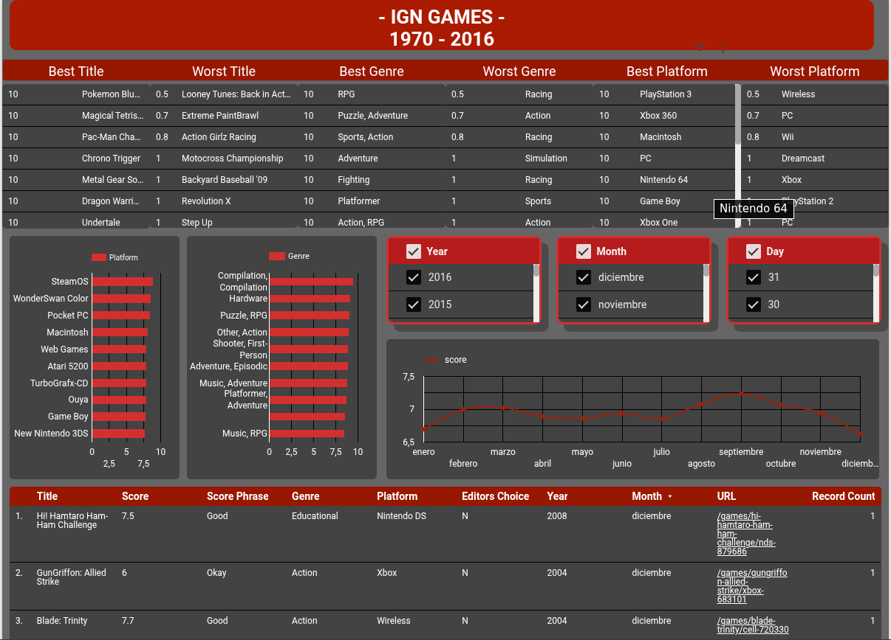

<div align="center">

# 🎮 EDA — IGN Games

**Análisis Exploratorio de Datos sobre el desempeño y calificación de videojuegos según IGN**  
*Recolección · Procesamiento · Limpieza · SQL · Visualización · Business Intelligence*

[](https://python.org)
[](https://jupyter.org)
[](https://www.mysql.com)
[](https://powerbi.microsoft.com)
[](https://lookerstudio.google.com)
[](https://www.kaggle.com/datasets/joebeachcapital/ign-games)

</div>

---

## 📌 Descripción del Proyecto

Este proyecto realiza un **Análisis Exploratorio de Datos (EDA)** completo sobre el dataset de calificaciones y desempeño de videojuegos publicado por **IGN**, uno de los medios especializados en videojuegos más importantes del mundo. El flujo de trabajo cubre desde la recolección del dataset hasta la construcción de dashboards interactivos en dos herramientas de BI.

> 💡 **Estado del proyecto:** ✅ Completado

---

## 🖼️ Dashboard



---

## 🗂️ Estructura del Proyecto

```
EDA-IGN-GAME/
│
├── Insert_sql.ipynb        # Notebook: procesamiento, limpieza e inserción a SQL
├── db.sql                  # Base de datos SQL con los datos procesados (2.11 MB)
├── ign.csv                 # Dataset original de IGN descargado de Kaggle
├── Months.csv              # Tabla auxiliar de meses para enriquecimiento
├── Dashboard_Looker.url    # Acceso directo al dashboard de Google Looker
├── Dashboard_PowerBI.pbix  # Archivo de Power BI con el dashboard
└── README.md
```

---

## ⚙️ Flujo de Trabajo

```
┌──────────────────┐     ┌──────────────────┐     ┌──────────────────┐     ┌──────────────┐
│   RECOLECCIÓN    │────▶│  PROCESAMIENTO   │────▶│  CARGA A SQL     │────▶│      BI      │
│                  │     │                  │     │                  │     │              │
│ · Dataset Kaggle │     │ · Limpieza de    │     │ · Inserción a    │     │ · Looker     │
│   (ign.csv)      │     │   datos          │     │   base de datos  │     │   Studio     │
│ · Tabla meses    │     │ · Normalización  │     │ · db.sql (2 MB)  │     │ · Power BI   │
│   (Months.csv)   │     │ · Enriquecimien- │     │ · Consultas      │     │   (.pbix)    │
│                  │     │   to con meses   │     │   analíticas     │     │              │
└──────────────────┘     └──────────────────┘     └──────────────────┘     └──────────────┘
```

---

## 🛠️ Tecnologías Utilizadas

| Categoría | Herramienta | Uso en el Proyecto |
|-----------|-------------|-------------------|
| Lenguaje | Python 3 | Procesamiento y automatización |
| Notebook | Jupyter | EDA e inserción de datos |
| Base de Datos | SQL | Almacenamiento estructurado de datos |
| Visualización | Power BI | Dashboard interactivo (.pbix) |
| Visualización | Google Looker Studio | Dashboard en la nube |
| Datos | Kaggle | Fuente del dataset original |

---

## 📊 Análisis Realizados

- 🏆 **Rankings y calificaciones** — Juegos mejor y peor evaluados por IGN
- 📅 **Análisis temporal** — Tendencias de lanzamientos y calificaciones por año y mes
- 🕹️ **Por plataforma** — Distribución y desempeño de juegos por consola/plataforma
- 🎭 **Por género** — Géneros más populares y mejor valorados
- 📊 **Distribución de scores** — Comportamiento estadístico de las calificaciones
- 🔗 **Correlaciones** — Relación entre plataforma, género y calificación recibida

---

## 🚀 Cómo Reproducir el Proyecto

### 1. Clonar el repositorio

```bash
git clone https://github.com/juriel1/EDA-IGN-GAME.git
cd EDA-IGN-GAME
```

### 2. Obtener el dataset

El dataset original proviene de Kaggle. Puedes descargarlo directamente desde:

🔗 [IGN Games Dataset — Kaggle](https://www.kaggle.com/datasets/joebeachcapital/ign-games)

> El archivo `ign.csv` ya está incluido en el repositorio.

### 3. Configurar la base de datos

Puedes usar el archivo SQL incluido para restaurar la base de datos directamente:

```bash
mysql -u tu_usuario -p tu_base_de_datos < db.sql
```

O bien generar la base de datos desde el notebook:

```bash
jupyter notebook Insert_sql.ipynb
```

### 4. Explorar los dashboards

- **Power BI:** Abre `Dashboard_PowerBI.pbix` con Power BI Desktop
- **Google Looker:** Abre el acceso directo `Dashboard_Looker.url` en tu navegador

---

## 📁 Fuente de Datos

| Campo | Detalle |
|-------|---------|
| **Fuente** | IGN (Imagine Games Network) vía Kaggle |
| **URL** | [joebeachcapital/ign-games](https://www.kaggle.com/datasets/joebeachcapital/ign-games) |
| **Formato** | CSV |
| **Contenido** | Título, plataforma, género, score, release date |

---

## 👤 Autor

**Juriel** — Analista de Datos | Aspirante a Data Engineer & Data Scientist

[](https://github.com/juriel1)


---

<div align="center">
  <sub>⭐ Si este proyecto te fue útil, considera dejar una estrella en el repositorio</sub>
</div>
